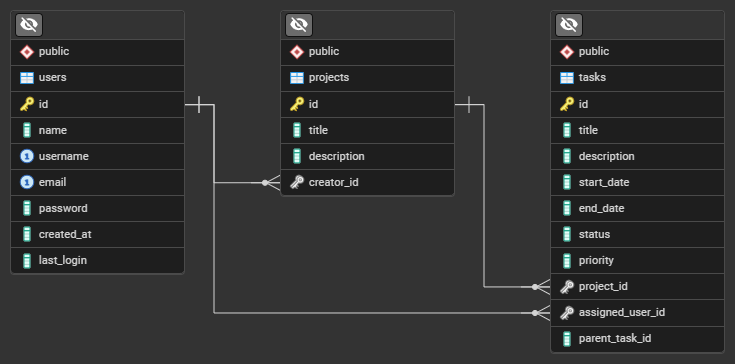

# Chrono Flow Project

**Chrono Flow Project** is a task flow platform designed to showcase my experience in software development using cutting-edge technologies. This project demonstrates proficiency in both backend and frontend development, containerization, and deployment practices.

> This project is a work in progress. New features and improvements are continuously being developed.

---

## Features

- Built with modern frameworks: **NestJS** for backend and **Next.js** for frontend.
- Fully containerized with **Docker** and orchestrated using **Docker Compose**.
- Comprehensive test coverage with **Jest**.
- Written entirely in **TypeScript** for type safety and maintainability.
- Scalable and modular architecture for future enhancements.
- Continuous integration and deployment using **GitHub Actions**.
- Secure user authentication with **JWT (JSON Web Tokens)** and **Passport**.

---

## Technologies Used

### Backend:
[](https://nextjs.org/)
[](https://www.postgresql.org/)
[](https://www.prisma.io/)
[](https://jwt.io/)
[](http://www.passportjs.org/)

- **Nest.js**: A progressive Node.js framework for building efficient and scalable server-side applications.
- **PostgreSQL**: Used for database management due to its reliability and scalability.
- **Prisma**: Simplifies database integration, providing a robust and easy-to-use API for data operations.
- **JWT**: For secure, stateless authentication, providing a compact way to authenticate users and protect routes.
- **Passport**: A flexible authentication middleware, integrating seamlessly with **JWT** and **Nest.js**.

#### Entity-Relationship Diagram (ERD)
The Entity-Relationship Diagram (ERD) provides a high-level overview of the database structure and the relationships between entities in the system. This diagram helps visualize how data flows and how different components of the application interact with each other.



> For more detailed information about the database schema and entity relationships, you can refer to the docs/schema folder, with SQL scripts and the ERD file.

### Frontend:
[](https://nextjs.org/)
[](https://mui.com/material-ui/)
[](https://emotion.sh/)
[](https://redux-toolkit.js.org/)


- **Next.js**: A React framework for production-grade web applications.
- **Material UI**: Customizable components, following Google's Material Design guidelines for rapid UI development.
- **Emotion**: A library for writing CSS styles with JavaScript, providing powerful tools for styling React components.
- **Redux**: For state management to maintain a predictable and centralized state across the application.
  
### Tools and Infrastructure (DevOps):
[](https://www.docker.com/)
[](https://docs.docker.com/compose/)
[](https://git-scm.com/)
[](https://www.pgadmin.org/)
[](https://jestjs.io/)
[](https://github.com/features/actions)
    
- **Docker**: For containerization of the application.
- **Docker Compose**: For managing multi-container applications.
- **Git**: Version control system.
- **pgAdmin**: For creating, managing, and querying databases efficiently.
- **Jest**: For unit and integration testing.
- **GitHub Actions**: For automating workflows such as continuous integration (CI) and continuous deployment (CD).

---

## Installation and Execution

### Prerequisites

Ensure the following tools are installed on your system:
- [Docker](https://www.docker.com/)
- [Docker Compose](https://docs.docker.com/compose/)

### Steps to Run the Project

1. Clone this repository:
   ```bash
   git clone https://github.com/Raqui333/chronoflowproject.git
   cd chronoflowproject
   ```
2. Set up environment variables by creating two .env files based on the .env.example file: one in the root directory and another in the backend directory:
   ```javascript
   // .env
   POSTGRES_USER="postgres_user"
   POSTGRES_PASSWORD="postgres_password"
   POSTGRES_DB="database_name"
   ```

   ```javascript
   // backend/.env
   DATABASE_URL="postgresql://<postgres_user>:<postges_password>@chronoflownetwork:5432/<database_name>"
   JWT_SECRET="randomphrase"
   ```

   > ⚠️ **Warning:** **do not use easily guessable passwords or phrases**. Weak passwords can be easily exploited and compromise the security of your application and database.
   
   > **NOTE:** In the `DATABASE_URL`, the network name may change depending on how you run the steps. By default, when using the `docker-compose` file, the network name will be `chronoflownetwork`. However, if running manually, you might need to change it to `localhost`.

3. Build and run the containers using Docker Compose:
   ```bash
   docker-compose up --build
   ```
4. Access the application:
- Frontend: http://localhost:3000
- Backend: http://localhost:5000
- Database: http://localhost:5432
